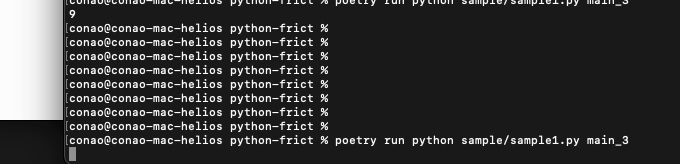

# frict

A lightweight Python library for in-place terminal output. Replace previous output with new content to create spinners, progress indicators, and dynamic terminal displays.



## Installation

```bash
pip install frict
```

## Quick Start

The `frict` context manager provides a callable that clears previous output before printing new content:

```python
import time
import frict

with frict.frict() as print_:
    for i in range(10):
        print_(f"Processing... {i + 1}/10")
        time.sleep(0.5)
```

## Examples

### Spinner

Create a simple terminal spinner:

```python
import time
import frict

signs = ['|', '/', '-', '\\']

with frict.frict() as print_:
    for i in range(30):
        print_(signs[i % len(signs)])
        time.sleep(0.1)
```

### Multi-line Animation

Build more complex animations with multi-line output:

```python
import math
import random
import time
import frict

signs = ['|', '/', '-', '\\']
total_frames = 50

with frict.frict() as print_:
    counter = 12532
    for i in range(total_frames):
        sign = signs[i % len(signs)]
        angle = (i / total_frames) * 4 * math.pi
        pos1 = int(math.sin(angle) * 15) + 15
        pos2 = int(math.sin(angle + 90) * 15) + 15
        if random.random() < 0.7:
            counter += int(random.random() * 500)
        output = f'''\
      {'*':>{pos1}}
   {sign} Welcome to my homepage! {sign}
      {sign} You are visitor number: {counter} {sign}
      {'*':>{pos2}}'''
        print_(output)
        time.sleep(0.1)
```

## How It Works

The library uses ANSI escape codes to move the cursor up and clear lines, allowing seamless replacement of terminal output. The context manager tracks line count automatically, so you can focus on what to display rather than how to clear previous content.

## Requirements

- Python 3.11+

## License

Apache-2.0
